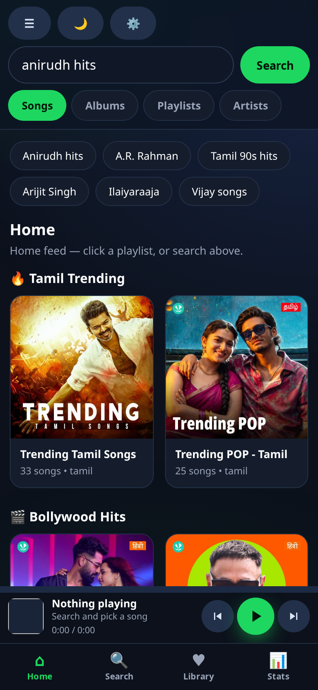
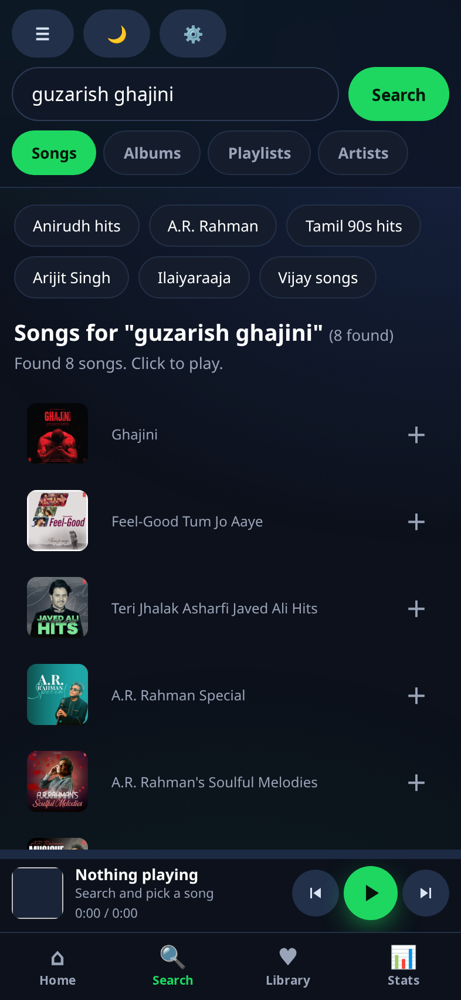
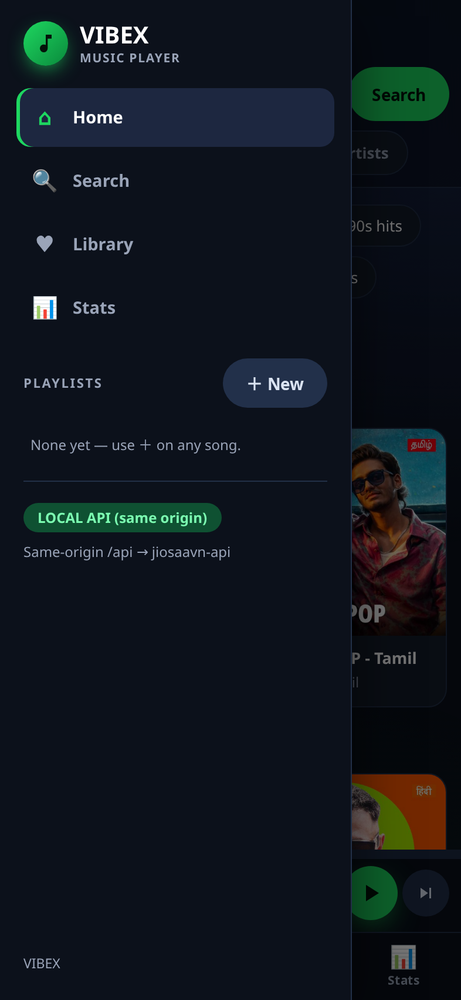
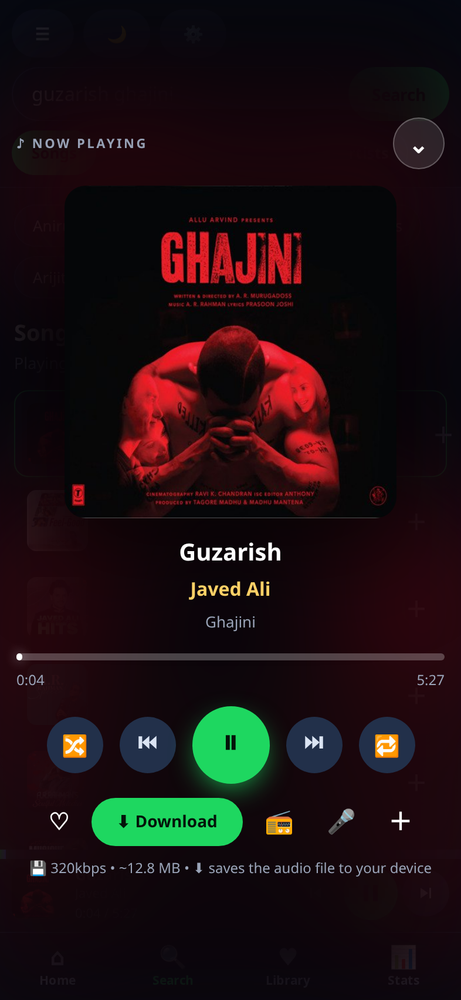

# VIBEX — Android app

A music player for Android. Search, stream, build playlists, read synced
lyrics, and download tagged tracks with cover art.

**This repository is the app download.** The source lives at
[Viswesh28/VIBEX](https://github.com/Viswesh28/VIBEX).

---

## Download

### ➡️ [**VIBEX.apk**](VIBEX.apk) — 4.25 MB

Or grab it from the [Releases](../../releases/latest) page.

| | |
|---|---|
| Version | 1.0 (versionCode 1) |
| Package | `dev.viswesh.vibex` |
| Requires | Android 6.0 (API 23) or newer |
| Built against | API 35 |
| Size | 4,455,761 bytes |
| Signing | Debug key — see the note below |
| SHA-256 | `25dcb1d7e5768547344764059895df438e74055407306f0c1d151d0af7878e96` |

Verify your download matches before installing:

```bash
sha256sum VIBEX.apk
```

---

## Installing

1. Download `VIBEX.apk` to your phone.
2. Tap it. Android will block the install the first time — it needs
   permission to install from whatever app you downloaded with:
   **Settings → Apps → Special access → Install unknown apps →** pick your
   browser or file manager **→ Allow from this source**.
3. Go back and tap the APK again. Install.

### About the security warning

This is a **debug-signed** build, so Play Protect will likely show
*"Unsafe app blocked"*. Tap **More details → Install anyway**.

That warning means "Google has not reviewed this app", not "this app is
malicious" — it appears for every sideloaded APK that did not come from the
Play Store. If that is not acceptable to you, build it yourself from
[the source repo](https://github.com/Viswesh28/VIBEX); the SHA-256 above lets
you confirm you are running exactly this build.

---

## Screenshots

| Home | Search |
|---|---|
|  |  |

| Menu | Now playing |
|---|---|
|  |  |

---

## What it does

- **Search** songs, albums, playlists and artists
- **Stream** at up to 320 kbps, with a quality selector
- **Playlists** you create locally, plus liked songs
- **Synced lyrics** that scroll with the track
- **Radio** — endless play seeded from any song or artist
- **Downloads** written with full metadata: title, artist, album, year,
  genre, lyrics and embedded cover art
- **Crossfade**, a visualiser, light and dark themes
- **Listening stats**

### No server required

The app is fully standalone. The API that talks to JioSaavn is bundled inside
the APK, so there is nothing to host, configure or keep running — it needs
only an internet connection.

---

## Known limitations

- **Playback stops when the app is backgrounded.** Background audio needs a
  foreground-service plugin that is not wired up yet.
- **Downloads** land in app-scoped storage (`Documents/VIBEX/`), so they may
  disappear if you uninstall the app.
- Not on the Play Store, and unlikely to be accepted there — sideload only.
- Only the hardware back button is handled; there is no edge-swipe gesture to
  open the menu.

---

## Legal

VIBEX streams from JioSaavn's public endpoints. It is **not** affiliated with,
endorsed by, or connected to JioSaavn or Saavn Media Pvt. Ltd. in any way. It
hosts no music itself.

This is a personal, educational project. Please respect the rights of artists
and rights-holders, and the terms of service of the platforms you use it with.

See [NOTICE.md](NOTICE.md) and [DMCA.md](DMCA.md). Licensed under the terms in
[LICENSE](LICENSE).
